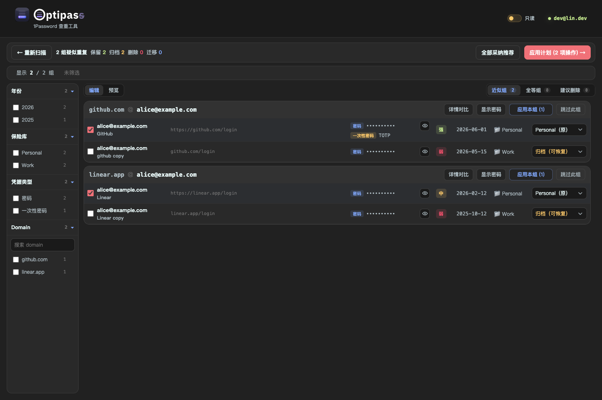
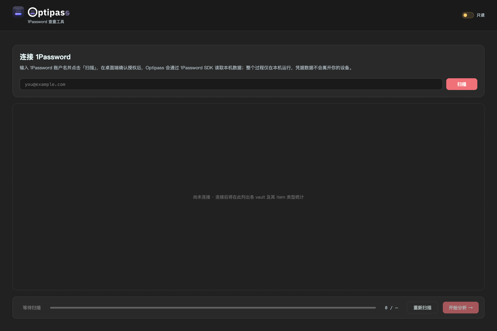
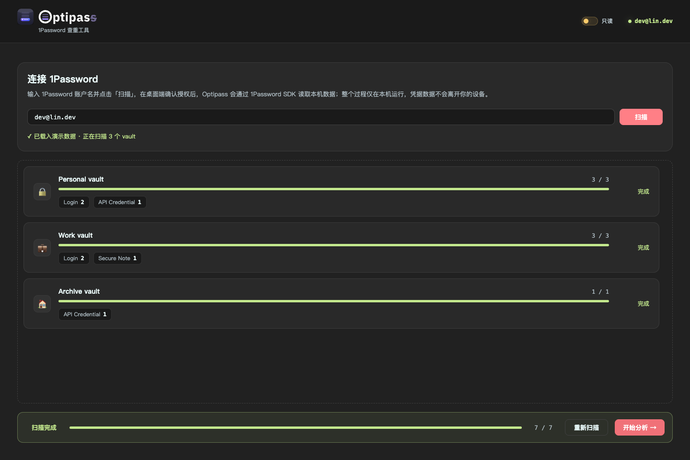
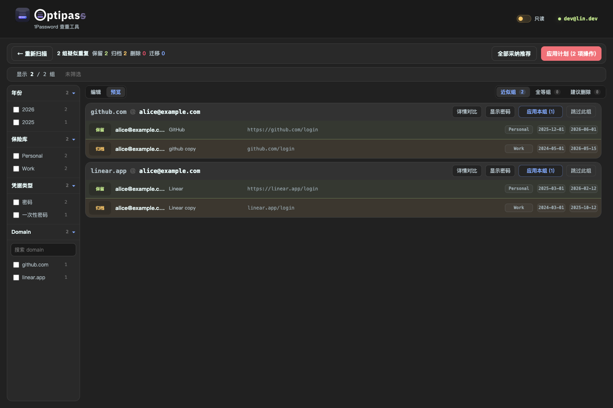

# Optipass

<p align="center">
  
</p>

<p align="center">
  <strong>本地优先的 1Password 重复凭据整理工具</strong>
</p>

<p align="center">
  <a href="https://github.com/BppleMan/optipass/actions/workflows/release-tauri.yml"></a>
  
  
  
  
</p>

Optipass 帮你在本机读取 1Password vault，找出重复、近似重复和缺少关键信息的登录项，然后生成可审查、可试运行的整理计划。它默认只读运行，真实归档、删除或跨 vault 迁移都需要你在界面里显式切换为可写。



## 功能亮点

- 本地读取 1Password 数据，后端默认只监听 `127.0.0.1`。
- 支持 1Password Desktop App 交互授权，也支持 service account。
- 按 URL、账号身份、凭据材料、标题、字段、附件、TOTP、Passkey 等信号分析重复项。
- 区分近似组、全等组和建议删除项，并提供推荐保留项。
- 可按年份、vault、凭据类型、domain 等维度筛选重复组。
- 密码、TOTP secret、API key 等敏感值默认不展示，只显示是否存在和遮罩摘要。
- 执行前生成计划，先 dry-run，再允许真实执行。
- 默认归档而不是永久删除；永久删除需要输入确认短语。
- Tauri 桌面壳内置 Angular UI，并用随 App 分发的 Bun runtime 启动本地 API helper。

## 界面展示

连接页会提示 1Password 授权方式；不填写账号时可直接进入演示数据流程。



扫描完成后会展示各 vault 的 item 类型和扫描进度。



整理计划可在执行前预览，确认哪些 item 会保留、归档、删除或迁移。



## 安装

### 下载 DMG

从 [GitHub Releases](https://github.com/BppleMan/optipass/releases) 下载最新的 `Optipass-*-macos-arm64.dmg`，打开后把 `Optipass.app` 拖到 `/Applications`。

当前自动打包产物尚未接入 Apple Developer ID 签名和 notarization。如果 macOS 提示 App 已损坏，请看下方“macOS 提示已损坏”。

### 从源码运行

需要准备：

- Node.js 24+
- pnpm
- Rust toolchain
- Just
- 1Password 桌面 App，并开启 Settings > Developer > Integrate with other apps

安装依赖：

```bash
just install
```

浏览器开发模式：

```bash
just dev-browser
```

生产单服务模式：

```bash
just serve-local
```

Tauri 桌面开发模式：

```bash
just dev-tauri
```

构建本地 Tauri 包：

```bash
just build-tauri
```

## 使用方式

1. 打开 Optipass。
2. 输入 1Password account name 或 account UUID，然后点击“扫描”。
3. 在 1Password 桌面 App 中确认授权。
4. 扫描完成后点击“开始分析”。
5. 在重复组里选择要保留的 item，必要时调整归档、删除或迁移策略。
6. 先预览计划并 dry-run。
7. 确认无误后，在顶部状态栏从“只读”切换为“可写”，再执行真实变更。

如果只是想体验流程，可以不填写账号直接点击“扫描”，Optipass 会加载本地演示数据，不会连接 1Password。

也可以用环境变量设置默认账号：

```bash
OP_ACCOUNT_NAME="你的 1Password 账户名或 account_uuid" just dev-browser
```

使用 service account：

```bash
OP_SERVICE_ACCOUNT_TOKEN="ops_..." just dev-browser
```

service account 只能访问被授权的 vault；个人桌面整理更推荐 Desktop App 授权。

## macOS 提示已损坏

如果安装 release DMG 后看到类似“Optipass 已损坏，无法打开”的提示，通常不是文件真的损坏，而是未签名/未公证 App 被 Gatekeeper 拦截。

先把 App 拖到 `/Applications`，再执行：

```bash
xattr -dr com.apple.quarantine /Applications/Optipass.app
```

如果提示权限不足，再加 `sudo`：

```bash
sudo xattr -dr com.apple.quarantine /Applications/Optipass.app
```

长期方案是给发布流程接入 Apple Developer ID 签名和 notarization。未公证的公开下载 App 会持续受到 Gatekeeper 限制。

## 安全边界

- 不需要导出 `.1pux` 或 CSV。
- 1Password 原始 item 只在后端进程内存中处理，不写入磁盘。
- API 默认只监听本机 `127.0.0.1`。
- 前端和 API 返回 CSP、`X-Frame-Options`、`nosniff`、`no-store` 等基础安全响应头。
- UI 默认不展示密码、TOTP secret、API key 等敏感值。
- 可以随时清空当前扫描结果和后端内存缓存；这不会修改 1Password。
- 状态栏处于“只读”时，后端会拒绝真实归档、删除和迁移动作。
- 永久删除必须显式选择，并输入 `永久删除` 短语确认。

更完整的重复判定语义见 [docs/duplicate-semantics.md](docs/duplicate-semantics.md)。

## 开发与验证

仓库根目录使用 `justfile` 编排任务，各子项目各自保留 `package.json` 和 `pnpm-lock.yaml`。

常用命令：

```bash
just build-local
just test
just typecheck
just smoke-mock
just build-tauri
```

`just smoke-mock` 会清空传给临时服务的 `OP_ACCOUNT_NAME` 和 `OP_SERVICE_ACCOUNT_TOKEN`，只验证生产单服务模式、mock 扫描、鉴权、状态栏可写开关和敏感值脱敏，不会连接或修改真实 1Password 数据。

## 发布

推送 tag 后会触发 `.github/workflows/release-tauri.yml`：

1. 构建 core、API、Angular UI 和 Tauri app。
2. 打包 macOS DMG。
3. 用 GitHub Release Notes API 生成 changelog。
4. 创建 GitHub Release 并上传 DMG asset。

示例：

```bash
git tag v0.1.0
git push origin v0.1.0
```

## 迁移说明

1Password SDK 当前没有暴露独立的跨保险库 move API。Optipass 把跨保险库迁移设计为“在目标 vault 创建副本，成功后归档原 item”的两步计划。复制会包含字段、备注、标签、网站、附件字段和 Document 文件；如果读取或创建失败，源 item 不会被归档。含 Passkey 的 item 会被阻止跨保险库迁移，请保留在原保险库中处理。
